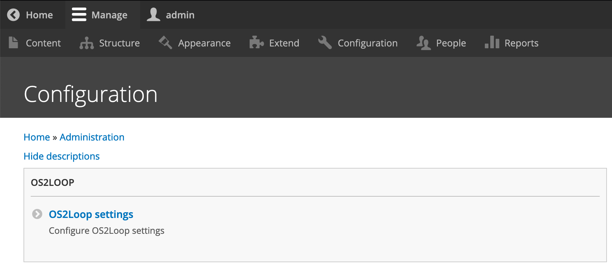

# OS2Loop Settings

This module (`os2loop_settings`) defines the “OS2Loop settings” configuration
item with general OS2Loop settings:



Modules can add their own settings form by declaring `parent:
os2loop.group.admin` in their `.links.menu.yml` file:

```yaml
[os2loop module name].settings:
  title: 'OS2Loop module settings'
  route_name: [os2loop module name].settings
  description: 'Configure OS2Loop module settings'
  parent: os2loop.group.admin
  weight: 10
```

See the [OS2Loop Flag content module](../os2loop_flag_content) for an example on
how to do this:

See the [OS2Loop Search DB module](../os2loop_search_db) for a complete example.

## Using settings

Inject `Drupal\os2loop_settings\Settings` into your helper, say:

```php
class Helper {
  public const MODULE = '[os2loop module name]';

  /**
   * @var \Drupal\os2loop_settings\Settings
   */
  private $settings;

  public function __construct(Settings $settings) {
    $this->settings = $settings;
  }

  public function doStuff() {
    $enable = $this->settings->get('enable', self::MODULE)
    if ($enable) {
      …
    }
  }
}
```

See the [OS2Loop Search DB module](../os2loop_search_db) for a complete example.

## Twig functions

This module adds the `is_granted` Twig function which can be used to check for
roles, general permissions and permissions on specific objects, e.g.

```twig

  You have the “editor” role.



  You can administer nodes.



  <a href="{{path('entity.node.edit_form', {node: node.id}) }}">Edit</a>

```

In general, `is_granted` takes an `attribute` and an optional `object` and checks
if the current user (if any) has a role or permission (the attribute) or can
perform an action on the object.

Modules can hook into the `is_granted` check by implementing
`hook_os2loop_settings_is_granted` (cf.
[`os2loop_settings.api.php`](os2loop_settings.api.php)).
